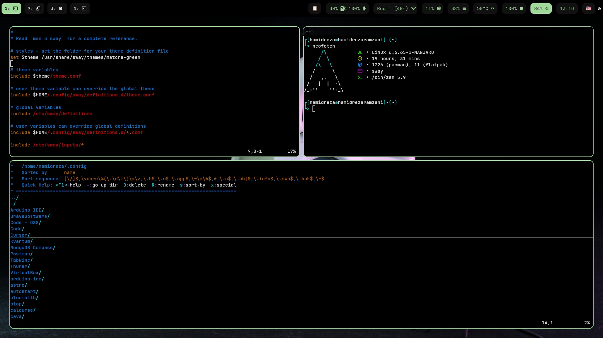

# 🧩 My Dotfiles

This is my personal dotfiles repository managed with [`yadm`](https://yadm.io/). It includes the configuration files I use on my Linux system — currently focused on a tiling Wayland setup.

## 📷 Screenshot

Here's a preview of my current Sway + Waybar setup:



## 📁 What’s included


- 🌅 [Sway](https://github.com/swaywm/sway) — Tiling Wayland compositor.  
  `~/.config/sway/config`

- 📊 [Waybar](https://github.com/Alexays/Waybar) — Customizable status bar with CSS styling.  
  `~/.config/waybar/config`, `~/.config/waybar/style.css`

- 🔔 [Mako](https://github.com/emersion/mako) — Lightweight notification daemon for Wayland.  
  `~/.config/mako/config`

- 🐚 [Zsh](https://www.zsh.org/) — Extensible shell with plugins, aliases, and theming.  
  `~/.zshrc`

- ✨ [Rofi](https://github.com/davatorium/rofi) — Minimal application launcher and menu system.  
  `~/.config/rofi/`

- 🚀 LazyVim — An opinionated, modular Neovim configuration for modern development.  
~/.config/nvim/


---

## 🚀 Setup (with `yadm`)

To clone and apply this setup:

```bash
yadm clone git@github.com:yourusername/dotfiles.git

