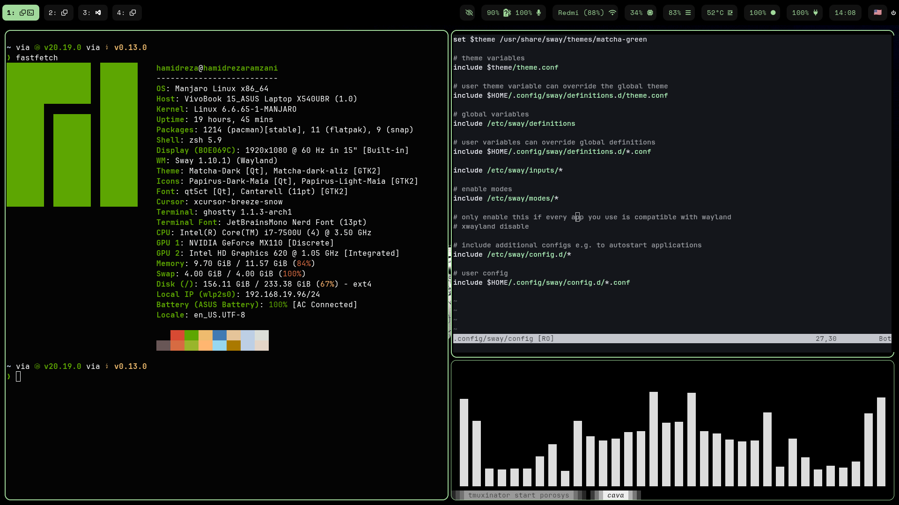

# 🧩 My Dotfiles

This is my personal dotfiles repository managed with [`yadm`](https://yadm.io/). It includes the configuration files I use on my Linux system — currently focused on a tiling Wayland setup.

## 📷 Screenshot

Here's a preview of my current Sway + Waybar setup:



## 📁 What’s included

### 🌅 [Sway](https://github.com/swaywm/sway)
A tiling Wayland compositor and drop-in replacement for i3.

- Custom keybindings
- Workspaces and layouts
- Autostart applications
- Power and lock controls

Config path: `~/.config/sway/config`

### 📊 [Waybar](https://github.com/Alexays/Waybar)
A highly customizable status bar for Sway and other Wayland compositors.

- Custom modules (CPU, memory, clock, etc.)
- Styled with CSS
- Keybinding integration with Sway

Config path:  
- `~/.config/waybar/config`  
- `~/.config/waybar/style.css`

### 🐚 [Zsh](https://www.zsh.org/)

A powerful and extensible shell that serves as a drop-in replacement for Bash.

* Custom prompt and theme
* Plugin support via a manager (e.g. [Oh My Zsh](https://ohmyz.sh/), [zinit](https://github.com/zdharma-continuum/zinit), or [zplug](https://github.com/zplug/zplug))
* Aliases and functions for productivity
* Shell options and history configuration

**Config path:** `~/.zshrc`


## ✨ Rofi

A powerful and minimal application launcher and dynamic menu system for Wayland/X11.

🎨 **Theme**
A customized version of [Qball’s Rofi theme](https://github.com/davatorium/rofi), styled with:

* A dark, minimal aesthetic
* Soft green accent color: `#a1d99b`
* Clean spacing and typography


📁 **Config Path**

```bash
~/.config/rofi/
```


---

## 🚀 Setup (with `yadm`)

To clone and apply this setup:

```bash
yadm clone git@github.com:yourusername/dotfiles.git
